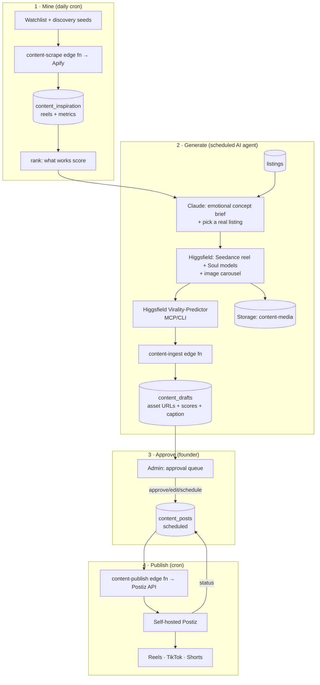

# feat: AIRLUXO Content-Automation Pipeline

## Summary

A content-ops subsystem inside the founder dashboard that turns emotional inspiration from Instagram creators into original, AI-generated AIRLUXO reels and carousels — featuring AI human models and **real cars from the platform**, emotion-first with only a subtle brand tag — then schedules and auto-posts them via self-hosted Postiz, with a human approval gate before anything goes live.

The pipeline has four stages: **mine** (scrape a watchlist + discover new high-performing creators via Apify, rank what works) → **generate** (Claude + Higgsfield produce reels/carousels with consistent AI models grounded in real listings) → **score & approve** (Higgsfield Virality-Predictor ranks candidates; founder approves in the admin) → **publish** (Postiz schedules to Reels/TikTok/Shorts).

Reference prior art: skaile's "Content-Maschine" (`content.skaile.de`) — Claude + Higgsfield MCP → Seedance video → Virality-Predictor → Postiz/Blotato via n8n. This plan adopts that backbone but adds inspiration-mining, real-car grounding, an emotional/human creative direction, an approval gate, and native (non-n8n) orchestration.

---

## Problem Frame

AIRLUXO needs a steady stream of emotionally resonant short-form social content (Reels, TikTok, Shorts) that conveys *the feeling* of an AIRLUXO experience — e.g. a couple road-tripping a car through the Swiss forest — rather than selling. Producing this by hand is slow and inconsistent. The goal is a mostly-autonomous machine that the founder steers with a watchlist and a one-click approval, not a full-time content team.

**Actors**
- **Founder (admin)** — sets the creator watchlist and creative guardrails, reviews the inspiration board, approves/edits/schedules drafts. The only human in the loop.
- **The machine** — scheduled jobs + an AI generation agent that mine, generate, score, and (on approval) publish.

---

## Goals & Success Criteria

- A new **Content** section in the founder dashboard with: Inspiration board, Draft/approval queue, Schedule/calendar, Settings (watchlist + guardrails).
- Daily inspiration mining: scrape watchlisted creators + discover similar high-performers; rank reels by a "what works" score.
- Generation produces **faceless-capable, AI-model-capable** reels (Seedance, 9:16) and image carousels, each grounded in a **real AIRLUXO listing** (car + photo), with a Claude-written caption that is emotion-first and carries only a subtle `@airluxo` tag.
- Each candidate carries a **virality/hook score**; only above-threshold drafts surface for approval.
- One-click approve → scheduled post via Postiz to the connected accounts; status syncs back into the admin.
- Nothing publishes without explicit founder approval (v1).

**Success =** the founder can go from empty watchlist to an approved, scheduled post entirely within the admin, and a daily cron keeps the inspiration board and draft queue fresh.

---

## Scope Boundaries

**In scope**
- Inspiration mining (Apify), ranking, and an inspiration board.
- AI generation of original reels + carousels grounded in real listings, with AI models (Higgsfield Soul) and emotional briefs.
- Virality scoring, approval queue, caption generation with brand guardrails.
- Self-hosted Postiz integration for scheduling/auto-posting + status sync.
- Native orchestration via Supabase edge functions + pg_cron.

### Deferred to Follow-Up Work
- Full hands-off auto-posting (no approval gate) — gated behind a later toggle once trust is established.
- Multi-language captions (reuse the i18n approach later).
- A/B-testing post variants and a performance feedback loop (posted-content analytics feeding back into concept selection).
- Migrating generation from agent-driven (MCP/CLI) to fully REST-autonomous once Higgsfield exposes a Virality REST endpoint.
- Blotato or n8n as an alternative posting/orchestration layer.

### Non-Goals
- Reposting creators' actual footage — inspiration only (rights-safe). The pipeline never republishes scraped media.
- Paid-ad creative / performance-marketing campaigns.
- A public-facing or partner-facing content tool — this is founder-admin only.

---

## High-Level Technical Design

**Why this shape.** The Virality-Predictor and Soul/Seedance creative iteration live in the Higgsfield MCP/CLI (not the REST API), and AIRLUXO has no headless GPU worker — so **generation is driven by a scheduled Claude agent** (Claude Code routine using the installed Higgsfield MCP + `higgsfield-*` skills), which posts finished assets + scores into Supabase via a thin `content-ingest` edge function. Everything that *is* pure backend — scraping, ranking, storage, approval state, scheduling, posting — runs natively as edge functions + pg_cron, mirroring the existing marketing-automation pattern. This keeps each tool where it actually runs and avoids standing up n8n.

---

## Key Technical Decisions

**KTD-1 — The whole pipeline is agent-driven via MCP (Apify + Higgsfield), not backend-autonomous (v1).**
Higgsfield's REST API can generate headlessly, but the **Virality-Predictor is confirmed only via MCP/CLI/app**, and Soul iteration is smoother through the MCP; AIRLUXO also has no server-side GPU/worker. A scheduled Claude agent therefore runs the full mine→brief→generate→score loop using the **Apify MCP** (discovery + reel metrics) and the **Higgsfield MCP** + `higgsfield-generate`/`-soul-id` skills, then writes results to Supabase through two thin service-role edge functions — `content-inspiration-ingest` (mined reels) and `content-ingest` (finished drafts). Rationale: leverages tools already installed/authenticated; keeps Apify + Higgsfield auth in the agent's MCP (no `APIFY_TOKEN`/`HIGGSFIELD_API_KEY` on Supabase, one fewer cron); the agent can *reason* about discovery rather than run a fixed query. **Fallback:** a backend `content-scrape` edge fn + cron using the Apify REST `run-sync-get-dataset-items` endpoint, only if scraping must run decoupled from the agent. Migration to fully REST-autonomous generation is deferred until a Virality REST endpoint exists. **Caveat:** verify the Apify MCP authenticates non-interactively (API token) in the scheduled/headless agent context.

**KTD-2 — Native orchestration (Supabase edge fns + pg_cron), no n8n.**
AIRLUXO already has the marketing cron+Vault pattern (`supabase/migrations/20260604_marketing_birthday_cron.sql`) and admin edge-fn auth (`supabase/functions/admin-update-partner/index.ts`). Reuse it for scraping and publishing. n8n would add another hosted service for no essential gain. (See Alternatives.)

**KTD-3 — Inspiration is mined, content is original.**
Apify scrapes only **public** creator reels + metrics for *pattern analysis and ranking*; generated content is original Higgsfield output grounded in real listings. The pipeline never republishes scraped media. Rationale: rights-safe and on-brand; sidesteps copyright while still learning "what works."

**KTD-4 — Real-car grounding via existing listings + `listing-photos`.**
Concepts pick a real listing (`src/lib/listings.js` `mapListing`: make/model/year/colour/category/`photo_url`/`city`) and feed its photo into Higgsfield image/video generation so the on-screen car matches a bookable car. Rationale: authenticity + a natural soft link to the platform.

**KTD-5 — Approval gate is mandatory in v1.**
Drafts never auto-publish; the founder approves/edits/schedules. Auto-post is a deferred toggle. Rationale: brand safety for AI-generated content with AI humans; builds trust before autonomy.

**KTD-6 — Brand guardrails encoded as a reusable brief/caption spec.**
Emotion-first, AI-human storytelling (e.g. couple + car + Swiss landscape), **no sales pitch**, only a subtle `@airluxo` tag/sticker. Encoded as a structured concept brief + a Claude caption prompt with hard constraints. Rationale: consistency and on-brand tone across every generation.

**KTD-7 — New `content-media` storage bucket (public), separate from `listing-photos`.**
Generated reels/carousels live in their own bucket to keep marketing media distinct from partner car photos. Rationale: clean separation, independent lifecycle/retention.

---

## Data Model

New tables (admin-gated via `is_admin()` RPCs, same posture as the prospect/marketing tables; RLS on, no client policy — access via SECURITY DEFINER RPCs / service-role edge fns):

- **`content_watchlist`** — `id`, `platform` (default `instagram`), `handle`, `note`, `active`, `created_at`. The seed creators to mine + discovery seeds (hashtags).
- **`content_inspiration`** — `id`, `source_handle`, `reel_url`, `caption`, `hashtags jsonb`, `views`, `likes`, `comments`, `posted_at`, `audio_title`, `emotion_tags jsonb` (Claude-derived), `work_score numeric` (ranking), `scraped_at`. Public-data only; minimal retention (see Risks).
- **`content_drafts`** — `id`, `listing_id` (FK, the grounded car), `format` (`reel`|`carousel`), `concept_brief jsonb`, `asset_urls jsonb` (storage URLs), `caption`, `virality_score numeric`, `hook_score numeric`, `status` (`generated`|`approved`|`rejected`|`scheduled`|`posted`|`failed`), `inspiration_ids jsonb`, `created_at`.
- **`content_posts`** — `id`, `draft_id` (FK), `postiz_post_id`, `scheduled_for`, `targets jsonb` (which channels), `status` (`scheduled`|`publishing`|`posted`|`failed`), `posted_at`, `error`, `created_at`.

---

## Implementation Units

### Phase 1 — Data model + admin shell

### U1. Content subsystem schema + admin RPCs + storage bucket
**Goal:** Persist the four tables, the admin read/write RPCs, and a public `content-media` storage bucket.
**Requirements:** Goals (data backbone); KTD-3, KTD-4, KTD-7.
**Dependencies:** none.
**Files:**
- `supabase/migrations/20260616-002-content-foundation.sql` (tables, RLS, RPCs: `admin_list_watchlist`, `admin_upsert_watchlist`, `admin_delete_watchlist`, `admin_list_inspiration`, `admin_list_drafts`, `admin_set_draft_status`, `admin_list_content_posts`)
- `src/lib/content.js` (client wrappers around the RPCs/edge fns — mirror `src/lib/prospects.js`)
- Storage: create `content-media` bucket (public) — via dashboard/CLI; document in migration comment.
**Approach:** Mirror the prospect-pipeline migration shape (`supabase/migrations/20260603_prospect_pipeline.sql`) and RPC auth (`is_admin()` guard inside SECURITY DEFINER). jsonb for flexible metric/score blobs.
**Patterns to follow:** `admin_list_prospects` / `admin_set_prospect_stage` (RPC + is_admin), `uploadListingPhoto` bucket pattern in `src/lib/listings.js`.
**Test scenarios:**
- Happy: `admin_upsert_watchlist` inserts then updates by id; `admin_list_*` return rows only for an admin caller.
- Edge: empty tables return `[]`; `admin_set_draft_status` rejects an invalid status value.
- Error/authz: a non-admin JWT calling any RPC raises `not authorized`; anon cannot select the tables directly (RLS deny).
- Integration: a draft row's `listing_id` FK resolves to a real listing; deleting a watchlist row leaves existing inspiration intact.
**Verification:** Migration applies cleanly (HTTP 201 via Management API); RPCs callable from the client lib as admin; bucket exists and accepts a test upload returning a public URL.

### U2. "Content" dashboard section shell (nav + tabs)
**Goal:** Add the Content section with four sub-tabs (Inspiration, Drafts, Schedule, Settings) wired to the lib, no live data behaviour yet beyond listing.
**Requirements:** Goals (admin surface).
**Dependencies:** U1.
**Files:** `src/components/FounderDashboard.jsx` (NAV entry + render-ternary case + `function Content()` with tab state), reuse `usePager`/`TablePager`, `AdminField`, the standard table shell + modal pattern.
**Approach:** Add `{ key: 'content', label: 'Content' }` to `NAV` (lines 21–31) and `section === 'content' ? <Content />` to the render ternary (lines 155–164). Sub-tabs via local state like the Finance period toggle. Tables use the shared shell (card `bg-cloud`, transparent header, `bg-paper` rows, `px-4 py-3 font-bold`, `usePager`) per the house pattern.
**Patterns to follow:** `Finance` / `Overview` section structure; `usePager`+`TablePager`; `Icon.*` from `src/components/Icons.jsx`.
**Test scenarios:**
- Happy: selecting Content renders the section; tab switching shows each table; pager paginates inspiration/drafts at 25/page.
- Edge: empty states render ("No inspiration yet", "No drafts").
- Test expectation: light — primarily visual/UI; cover tab-switch state + pager via the existing build + a smoke check.
**Verification:** `npx vite build` green; Content appears in the menu; tabs and pagination behave like the other sections.

### Phase 2 — Inspiration mining

### U3. Inspiration mining via Apify MCP (agent-driven) + ingest write-path
**Goal:** The scheduled agent mines watchlisted creators + discovers similar high-performers through the Apify MCP, ranks reels by a "what works" score, and persists them — without any Apify auth on Supabase.
**Requirements:** Goals (daily mining); KTD-1, KTD-3.
**Dependencies:** U1.
**Files:**
- `supabase/functions/content-inspiration-ingest/index.ts` — service-role batch upsert into `content_inspiration` (idempotent on `reel_url`; does not clobber `manual` rows). **Built + deployed.**
- The mining steps themselves live in the U5 agent routine (`docs/content-automation/generation-agent.md`).
**Approach:** The agent (service-role) reads the active `content_watchlist`, calls the **Apify MCP** (`instagram-reel-scraper` for metrics + `instagram-search`/`related-person` for discovery), computes `work_score` (normalized blend of views/likes/comments + recency + cadence), and batch-POSTs to `content-inspiration-ingest`. On the same pass it enriches `manual` links missing metrics. No `APIFY_TOKEN`, no scrape cron — cadence comes from the agent's schedule.
**Approach note (privacy):** store only public fields, minimal retention; see Risks (GDPR/FADP).
**Fallback (deferred):** if scraping must run decoupled from the agent, add a `content-scrape` edge fn + pg_cron using the Apify REST `run-sync-get-dataset-items` endpoint + `APIFY_TOKEN` (research §Apify).
**Patterns to follow:** `content-ingest` (service-role bearer auth + upsert); marketing cron pattern only if the REST fallback is built.
**Test scenarios:**
- Happy: a batch of reels POSTed to `content-inspiration-ingest` upserts rows with metrics; re-posting updates, not duplicates (conflict on `reel_url`).
- Edge: empty `items` → 422; a reel already present as `manual` keeps its note/source flag.
- Error: wrong/missing service-role bearer → 401.
- Integration: agent run reads the watchlist, mines via Apify MCP, and the rows appear ranked in the Inspiration tab.
**Verification:** After an agent run, `content_inspiration` holds ranked rows visible in the admin; no Apify secret exists on Supabase.

### U4. Inspiration → concept brief (emotional pattern distillation)
**Goal:** Turn top-ranked inspiration into structured AIRLUXO concept briefs (emotion theme, hook, scene direction) and tag inspiration rows with `emotion_tags`.
**Requirements:** Goals; KTD-3, KTD-6.
**Dependencies:** U3.
**Files:** `supabase/functions/content-brief/index.ts` (Claude/Gemini text → structured brief JSON) **or** part of the generation agent's routine (see U5). `src/lib/content.js` (trigger + read briefs).
**Approach:** Summarize the week's top reels (captions, hashtags, audio, metrics) and ask the model to extract recurring *emotional* patterns and propose N AIRLUXO briefs, each: emotion theme, hook line, scene concept (e.g. couple + car + Swiss forest), suggested car category. Briefs reference but never copy source media. Pick a real listing per brief (category match) to ground it.
**Approach note:** if generation is fully agent-driven (KTD-1), the brief step can live in the agent prompt rather than a separate edge fn — decide at execution time (see Open Questions).
**Patterns to follow:** `generate-description` Gemini call shape; structured-JSON extraction with defensive parsing (as in `enrich-prospect`).
**Test scenarios:**
- Happy: given ≥5 ranked reels, returns N briefs each with emotion theme + hook + a grounded `listing_id`.
- Edge: fewer than threshold inspiration rows → returns a clearly-flagged "not enough signal" result.
- Error: model returns non-JSON → defensive parse surfaces a diagnostic, not a crash.
- Covers KTD-6: briefs contain no sales-pitch language and request only a subtle tag.
**Verification:** Briefs render in the admin Inspiration tab and are selectable as generation inputs.

### Phase 3 — Generation

### U5. Generation pipeline (Higgsfield) + content-ingest contract
**Goal:** From a brief + grounded listing, generate a reel (Seedance, 9:16, AI models via Soul) and/or carousel (Higgsfield images), score virality, and persist a draft.
**Requirements:** Goals; KTD-1, KTD-4, KTD-7.
**Dependencies:** U1, U4.
**Files:**
- `supabase/functions/content-ingest/index.ts` (service-role; accepts `{ brief, listing_id, format, asset_urls, caption, virality_score, hook_score, inspiration_ids }`, inserts a `content_drafts` row)
- A scheduled generation agent definition (Claude Code routine via the `schedule` skill) documented in `docs/content-automation/generation-agent.md` — drives Higgsfield MCP + `higgsfield-generate`/`-soul-id`, uploads assets to `content-media`, then calls `content-ingest`.
**Approach (KTD-1):** The agent: (1) reads the chosen brief + listing photo, (2) generates a Soul-based AI-model scene + Seedance reel and/or an image carousel grounded in the real car, (3) runs the Higgsfield Virality-Predictor (MCP/CLI) on the clip, (4) uploads finished assets to the `content-media` bucket, (5) POSTs metadata to `content-ingest`. A consistent brand Soul ID (trained once via `higgsfield-soul-id`) gives recurring AI models.
**Execution note:** Build the `content-ingest` contract test-first (request/response + draft row shape) so the agent has a stable target before the agent prompt is finalized.
**Patterns to follow:** `studio-shot` (generated-media handling), `uploadListingPhoto` (bucket upload + public URL), admin edge-fn boilerplate.
**Test scenarios:**
- Happy: a valid ingest payload creates a `generated` draft with asset URLs + scores; the draft links to the real `listing_id`.
- Edge: missing/empty `asset_urls` rejected (422); below-threshold `virality_score` still stored but flagged so the queue can hide it.
- Error: bad `listing_id` FK → 400; oversized payload → use uploaded URLs, never inline media.
- Integration: end-to-end dry run — brief → agent generates → asset lands in `content-media` → draft visible in the admin Drafts tab with a playable URL.
**Verification:** A generated reel + carousel for a real listing appear in the Drafts queue with virality/hook scores and a playable/viewable asset.

### U6. Brand-safety guardrails + caption generator
**Goal:** A reusable creative spec + Claude caption generator enforcing emotion-first tone, AI-human storytelling, and a subtle `@airluxo` tag (no sales pitch).
**Requirements:** Goals; KTD-6.
**Dependencies:** U5 (consumes/produces draft caption).
**Files:** `src/lib/content-brief-spec.js` (the structured guardrail spec + prompt fragments) consumed by U4/U5; caption generation inside `content-ingest` or the agent.
**Approach:** Encode hard constraints (no price, no "book now", ≤1 subtle tag, emotion + scene led) and a few exemplar captions. Caption generated per draft; editable in the approval UI.
**Patterns to follow:** the `generate-description` prompt discipline (tone constraints, "return only …").
**Test scenarios:**
- Happy: caption is emotion-led, contains exactly one subtle tag, no pricing/CTA language.
- Edge: very sparse brief still yields a valid on-tone caption.
- Covers KTD-6: a caption containing a banned phrase ("book now", a price) is rejected/regenerated.
**Verification:** Generated captions consistently match the guardrails on a sample of briefs.

### Phase 4 — Approval + publish

### U7. Approval queue UI + actions
**Goal:** Founder reviews drafts (play reel / view carousel), edits caption, sets schedule, approves or rejects.
**Requirements:** Goals; KTD-5.
**Dependencies:** U2, U5.
**Files:** `src/components/FounderDashboard.jsx` (Drafts tab in `Content`: cards with media preview, score badges, caption editor, channel + datetime picker, approve/reject) + `src/lib/content.js` actions (`setDraftStatus`, `scheduleDraft`).
**Approach:** Card/modal pattern like the prospect info sheet; approve writes a `content_posts` row (`scheduled`) with targets + `scheduled_for`. Reject sets draft `rejected`. Show virality/hook score + the grounding listing.
**Patterns to follow:** `ProspectInfoModal` (edit + save), score badges like the Security section, `Icon.ArrowUpRight`.
**Test scenarios:**
- Happy: approve with a chosen time + channels creates a `scheduled` post row; reject hides the draft.
- Edge: cannot schedule in the past; approving without a channel is blocked.
- Error: a failed schedule write surfaces inline; the draft stays editable.
- Integration: an approved draft appears in the Schedule tab and is picked up by the publish cron (U8).
**Verification:** Founder can approve+schedule a draft entirely in the admin; it lands in the Schedule calendar.

### U8. Postiz integration (self-host prereq) + publish cron + status sync
**Goal:** Dispatch due scheduled posts to self-hosted Postiz (upload media + schedule), and sync status back.
**Requirements:** Goals; KTD-2.
**Dependencies:** U7; Postiz self-host + per-platform OAuth (prerequisite, see Dependencies).
**Files:**
- `supabase/functions/content-publish/index.ts` (service-role; for due `content_posts`: Postiz `/public/v1/upload` then `/public/v1/posts` with caption + schedule + integration ids; update status/`postiz_post_id`)
- `supabase/migrations/20260616-004-content-publish-cron.sql` (pg_cron every N min → `content-publish`)
- `src/lib/content.js` (manual "publish now" + status read)
**Approach:** Reuse the cron+Vault + admin edge-fn patterns. Read `POSTIZ_API_KEY` + `POSTIZ_BASE_URL` from `Deno.env`. Pre-upload media via `/upload` (50MB payload limit → never inline). Respect Postiz rate limit (~90/hr self-host). Map AIRLUXO channels → Postiz integration ids. Update `content_posts.status`/`posted_at`/`error`.
**Patterns to follow:** marketing cron migration; `marketing-run` style "process due rows" edge fn.
**Test scenarios:**
- Happy: a due `scheduled` post is uploaded + scheduled in Postiz; row flips to `posted` with `postiz_post_id`.
- Edge: nothing due → no-op; a post whose `scheduled_for` is future is skipped.
- Error: Postiz upload/schedule failure → row `failed` with `error`, retried next tick (bounded retries); rate-limit hit → defer.
- Integration: full path on staging — approve a draft → cron dispatches → Postiz shows a scheduled post → status syncs back to `posted`.
**Verification:** An approved draft auto-publishes via Postiz on schedule and the admin reflects `posted`; failures are visible and retried.

---

## Dependencies / Prerequisites

- **Higgsfield**: installed MCP + CLI + `higgsfield-*` skills (done this session, authenticated). Confirm plan tier covers the needed generation volume; **API entitlement may require the ULTRA tier** if a REST path is later used. A one-time brand **Soul ID** trained via `higgsfield-soul-id` for recurring AI models.
- **Apify**: account + `APIFY_TOKEN` secret. Budget ~$1.50–2.60 / 1,000 reels; set a per-run cap.
- **Postiz**: self-hosted (Docker + Postgres + Redis); `POSTIZ_API_KEY` + base URL; **per-platform OAuth apps** — Instagram **Business/Creator** via the Graph API, TikTok content-posting API (audited app for auto-publish), YouTube Data API. Connect the AIRLUXO accounts inside Postiz.
- **Secrets** (set via Supabase dashboard/CLI — not MCP; project ref `shoeopxxjawmusgnjxfh`): `APIFY_TOKEN`, `POSTIZ_API_KEY`, `POSTIZ_BASE_URL`, optional `HIGGSFIELD_API_KEY` (REST path). `sb_service_role_key` already in Vault for cron.
- **Scheduled generation agent**: a Claude Code routine (via the `schedule` skill) or claude.ai schedule that runs the generation step on cadence.

---

## Risks & Mitigations

- **GDPR / Swiss FADP on creator data (high).** Scraping public reels still processes creators' personal data (handles, faces, bios). Mitigate: store only public, minimal fields; short retention on `content_inspiration`; documented purpose; never scrape logged-in/private; no fake accounts. Treat as a founder legal sign-off item.
- **Instagram ToS (medium).** Public, logged-out scraping is a contract (not CFAA) matter and the actors scrape without login → no account-ban risk to AIRLUXO; still AIRLUXO's risk to accept. Isolated behind the single `content-scrape` fn so the provider is swappable.
- **Virality-Predictor has no REST endpoint (medium).** Scoring stays MCP/CLI (agent-driven) — the reason for KTD-1. If a REST endpoint ships, revisit for full autonomy. Fallback: a simple internal heuristic (hook length, motion, audio) if the MCP step is unavailable.
- **Platform auto-publish approval (medium).** IG/TikTok auto-publish is gated by each platform's official API approval status (e.g. TikTok unaudited-app limits). Verify on the self-host instance before relying on auto-publish; until then, Postiz can hold as draft for manual release.
- **AI-content brand safety (medium).** AI humans + AI cars can look "off." The mandatory approval gate (KTD-5) + guardrail spec (U6) + virality threshold keep weak content out.
- **Cost creep (low/medium).** Apify per-result + Higgsfield credits + Postiz hosting. Per-run caps, daily (not hourly) scrape cadence, and threshold-gated generation bound spend.

---

## Alternatives Considered

- **n8n (or Blotato) as the orchestration/posting layer** (skaile's stack). Rejected for v1 (KTD-2): adds another hosted service; AIRLUXO already has the edge-fn + cron backbone. Kept as a deferred option for rapid prototyping or non-dev editing.
- **Fully REST-autonomous generation (no agent).** Higgsfield REST can generate headlessly, but Virality-Predictor is MCP/CLI-only and there's no server GPU/worker. Deferred until a Virality REST endpoint exists.
- **Reposting/curating creators' clips.** Rejected (KTD-3, Non-Goals): copyright/licensing risk; inspiration-only is rights-safe.

---

## Open Questions (deferred to implementation)

- Does the brief step (U4) live in its own edge function or inside the generation agent prompt? Decide once the agent routine is prototyped — both are cheap to move.
- Exact `work_score` weighting (views vs likes vs comments vs recency vs cadence) — tune against real scraped data.
- Carousel generation specifics (how many frames, image model) — settle during U5 once Higgsfield image output is evaluated for cars.
- Whether to train one brand Soul ID or a small cast — start with one, expand if needed.
- Retention window for `content_inspiration` rows (FADP) — set a concrete TTL during U1/U3.

---

## Operational / Rollout Notes

- Ship behind the founder admin (already `is_admin()`-gated) — no public exposure.
- Roll out in phase order: U1–U2 (shell) → U3–U4 (mining) → U5–U6 (generation) → U7–U8 (approve+publish). Each phase is independently demoable on staging before promote.
- Keep the approval gate on until the founder is confident; only then consider the deferred auto-post toggle.
- Reuse the existing deploy flow: migrations via the Supabase Management API, edge functions via the CLI token, frontend promote `git push origin staging:main`.

---

## Sources & Research

- Prior art: skaile "Content-Maschine" — `https://content.skaile.de/` (Claude + Higgsfield → Seedance → Virality-Predictor → Postiz/Blotato via n8n).
- Higgsfield: `https://github.com/higgsfield-ai/higgsfield-js`, `https://github.com/higgsfield-ai/cli`, `https://higgsfield.ai/seedance/2.0`, `https://higgsfield.ai/soul-intro`; Virality-Predictor confirmed MCP/CLI-only.
- Postiz: `https://docs.postiz.com/public-api`, `https://docs.postiz.com/providers`, `https://github.com/gitroomhq/postiz-app`.
- Apify: `https://apify.com/apify/instagram-reel-scraper`, `https://apify.com/apify/instagram-search-scraper`, `https://docs.apify.com/api/v2/act-run-sync-get-dataset-items-post`; legal posture — *Meta v. Bright Data* (N.D. Cal. 2024), *hiQ v. LinkedIn* (9th Cir.).
- Repo patterns: `src/lib/listings.js` (`mapListing`, `listing-photos`), `src/components/FounderDashboard.jsx` (NAV/section, `usePager`), `supabase/functions/admin-update-partner/index.ts` (admin auth), `supabase/functions/studio-shot/index.ts` (media gen), `supabase/migrations/20260604_marketing_birthday_cron.sql` (cron+Vault).
