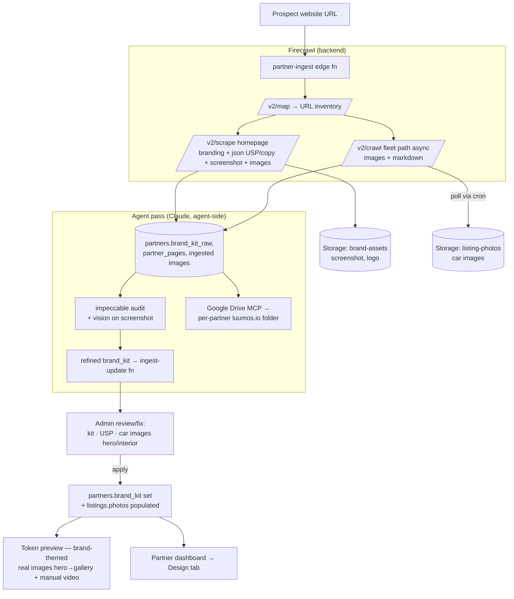

# feat: Partner White-Label Site — Ingest, Brand-Kit Theming, Content/Legal Pages & Own-Domain Deploy

## Summary

The full partner-acquisition engine: turn a prospect's existing website into **their own complete AIRLUXO-powered website, in their brand** — and optionally publish it on **their own domain**.

Given a partner's website URL, **Firecrawl** (backend edge function) extracts their **USP + page copy**, a **brand kit** (colours, fonts, logo — via Firecrawl's `branding` format), their **car images**, and a **tech-stack read** (CMS, payment integrations, booking tool — sales intel for the pitch). The **impeccable** skill audits/refines the kit (vision on a full-page screenshot), car images export to a **per-partner luumos.io Google Drive folder** (Drive MCP, agent-side) and into Supabase Storage. The founder reviews it in the admin and applies it — which themes the partner's site and a partner-dashboard **Design** section with the partner's **fonts + colours + logo only** (AIRLUXO's UI/UX is kept; CSS variables over our components). Cars show their **real images** — a hero "whole car" shot that opens an interior/detail gallery on click — with the existing **manual video slot** retained.

On top of the themed storefront, the partner gets a **full white-label website**: a home page with **their USP/about/benefits content**, the **fleet**, contact, and **Swiss legal pages (Impressum, privacy, terms)** generated from their legal-entity data. It serves at a **public route** (`airluxo.ch/p/<slug>`) and on the partner's **own domain** — default **multi-tenant** (partner points a CNAME at our deploy, resolved by hostname), with an optional **dedicated Vercel project per partner** as an isolation upsell.

This makes the sales pitch concrete ("here's your whole website, on our engine, in your brand, on your domain") and sets up the long-run goal: claim the prospect live and pull their listings via the partner dashboard into airluxo.ch.

---

## Problem Frame

To acquire rental partners, AIRLUXO offers to build their website + booking tool (the partner dashboard) and run their bookings. The blocker is making that offer tangible fast. Today the founder can create a prospect + manually build a fleet; there's no way to **ingest an existing partner's site** and instantly show them a branded, populated preview. This plan automates: site → brand kit + copy + car images → a branded, real-image preview the founder shares.

**Actors**
- **Founder (admin)** — pastes a prospect's URL, triggers ingest, reviews/fixes the extracted kit + car images, applies it, shares the branded preview.
- **Prospect/partner** — the subject; later (post-claim) edits their brand kit in the partner-dashboard **Design** tab.
- **The ingest** — Firecrawl edge function + an agent pass (impeccable audit + Drive export).

---

## Goals & Success Criteria

- A founder can paste a prospect's website URL in the Pipeline and **Analyze website** → within a couple of minutes the prospect has: an extracted **brand kit** (colours, fonts, logo), **USP + key page copy**, and their **car images** grouped per car.
- Car images are **exported to a dedicated luumos.io Google Drive folder** (one per partner) and stored in Supabase.
- The **impeccable** skill produces a refined, audited brand kit (validated against the screenshot).
- The founder **reviews + fixes** (hero vs interior grouping, assign images to cars, tweak colours/fonts) and **applies** — setting `partners.brand_kit` and creating/updating listings with a `photos` gallery.
- The **prospect preview** renders **brand-themed** (the partner's fonts + colours + logo over AIRLUXO's UI) with the **real car images** (hero → click → interior gallery) + the manual video slot.
- A partner-dashboard **Design** tab lets a (claimed) partner define colours/accents/fonts + see their brand kit incl. logo, live-previewing the storefront theming.

**Success =** paste URL → branded, real-image, on-brand preview the founder can share, end-to-end in the admin.

---

## Scope Boundaries

**In scope**
- Firecrawl ingest (brand kit + USP/copy + car images) via a backend edge function.
- Impeccable brand-kit audit + Google-Drive image export (agent-side).
- Multi-image per car (`photos` gallery: hero + interior/detail).
- Storefront/preview **theming by fonts + colours + logo only**, via CSS variables over AIRLUXO components.
- Admin review/apply flow; partner-dashboard **Design** tab.
- **Partner content pages** — a white-label **home page** (hero/USP, about, benefits, contact) + fleet, built from the ingested copy and editable in admin + the partner dashboard.
- **Swiss legal pages** — **Impressum**, privacy, terms generated from the partner's legal-entity data, plus a footer with legal links + "Powered by AIRLUXO".
- **Public routing** — a stable public route `airluxo.ch/p/<slug>` (no token) for a published partner site, gated by a `published` flag.
- **Own-domain deploy** — **multi-tenant** by default (partner CNAMEs their domain at our deploy; resolve partner by hostname), with an **optional dedicated Vercel project per partner** for isolation.

### Deferred to Follow-Up Work
- Theming the **partner-dashboard chrome** (the public partner site + storefront are themed; the back-office dashboard stays AIRLUXO-styled).
- AI thumbnail/video generation (use the partner's real images; the manual video slot stays).
- The live **listings-API pull** into airluxo.ch (the long-run goal).
- Auto re-ingest / change-tracking of a partner site over time.
- A **visual page/section builder** (drag-drop) — v1 edits a fixed set of content sections; freeform layout is later.

### Non-Goals
- Cloning the partner's full design system / layout — AIRLUXO's UI/UX is the product; only fonts + colours + logo change.
- Republishing partner marketing copy verbatim as AIRLUXO content (copy informs the pitch, not the live marketplace).

---

## High-Level Technical Design

**Why this shape.** Firecrawl's crawl + `branding` + screenshot are pure backend (an edge function with `FIRECRAWL_API_KEY`), reusing the existing async-poll cron pattern from `content-scrape`. The **impeccable** skill and the **Google Drive MCP** run agent-side (Claude), so the audit + Drive export are an agent pass over the ingest results — the same backend-ingest / agent-enrich split used by the content pipeline. Theming is a thin extension of `Embed.jsx`'s existing `--color-*` override.

---

## Key Technical Decisions

**KTD-1 — Firecrawl in a backend edge function; `branding` format is the brand-kit source of truth.**
A `partner-ingest` edge fn calls Firecrawl REST (`fetch`, Bearer `FIRECRAWL_API_KEY`): `/v2/map` → URL inventory; **sync `/v2/scrape`** the homepage with `["markdown","branding","images",{screenshot fullPage},{json: USP+copy schema}]`; **async `/v2/crawl`** the fleet path (`includePaths`) with `scrapeOptions.formats:["images","markdown"]` for all car images, polled via cron (reuse the `content-scrape` job pattern). Rationale: `branding` returns structured colours/fonts/logo in one call; sync scrape fits the edge-fn wall-clock; crawl is the only multi-page path so it must be async. **Firecrawl asset URLs expire in 24h → persist screenshot + images to Supabase Storage on receipt.**

**KTD-2 — Impeccable audit + Drive export run agent-side, over the ingest result.**
The Firecrawl kit is a first pass; the **impeccable** skill (Claude-side) audits/refines it against the full-page screenshot (catches gradient/real-palette nuance flat hex misses) and writes a refined `brand_kit` back via a thin `partner-ingest-update` edge fn. The **Google Drive MCP** exports the car images to a per-partner folder under a luumos.io Drive root. Rationale: both tools are agent-only (no Deno runtime); mirrors the content pipeline's backend-ingest → agent-enrich split.

**KTD-3 — Theme by CSS variables (fonts + colours + logo only), keeping AIRLUXO UI/UX.**
The brand kit overrides `--color-*` and `--font-display`/`--font-sans` on the **storefront/preview root** (extending `Embed.jsx`'s `DARK_VARS` pattern) + shows the logo; AIRLUXO's components/layout are unchanged. Partner fonts load dynamically (Google Fonts/fontshare URL in the kit, with a safe fallback). Rationale: the user wants our UX kept; CSS-var scoping is already proven in `Embed.jsx`. Dashboard-chrome theming is deferred.

**KTD-4 — Add a `photos` gallery to listings (hero + interior/detail).**
Listings currently hold only `photo_url` + `video_url`. Add `photos jsonb` = `[{ url, type: 'hero'|'interior'|'detail', caption }]`. CarDetail shows the **hero** (whole car); clicking it opens a gallery of the remaining shots; the existing **manual `video_url` slot** is unchanged. `photo_url` stays the hero for back-compat. Rationale: the preview needs the real multi-image experience; jsonb avoids a join table for v1.

**KTD-5 — Ingested data extends the prospect record; images live with listings; Drive is per-partner.**
`partners` gains `brand_kit jsonb` (applied/live kit) + `brand_kit_raw jsonb` (Firecrawl proposal) + a `partner_pages jsonb` (USP + key page copy). Car images associate to **listings.photos**. Drive: one folder per partner under a configured luumos.io root. Rationale: reuse the storefront/listings the preview already renders; no separate silo.

**KTD-6 — Image grouping is auto-proposed, founder-reviewed.**
A vision pass proposes per-car grouping + hero/interior type; the founder fixes it in the admin before apply. Rationale: auto-classification is fuzzy; a human gate keeps the preview clean.

**KTD-7 — White-label site = a fixed-section content shell over the themed storefront (no freeform builder).**
The partner's full site is `site_config.sections` (hero/USP · about · benefits · contact) rendered by presentational components around the existing themed fleet — not a drag-drop page builder. Sections seed from the ingested copy and are founder/partner-editable. Rationale: a fixed section set ships fast, keeps AIRLUXO's UX/quality, and matches "their content over our engine"; a visual builder is deferred.

**KTD-8 — Swiss legal pages generated from structured `legal` data, stored editable, flagged as a template.**
`partners.legal` (company, legal form, address, UID/CHE, VAT, contact, represented-by — pre-filled from pipeline fields) drives generated **Impressum/privacy/terms** into `legal_pages`, fully editable, with a footer. Rationale: Swiss sites need an Impressum; we already capture the entity data. The generated text is a **starting template for the partner's own review — not legal advice.**

**KTD-9 — Multi-tenant hostname resolution is the default deploy; dedicated Vercel per partner is an option.**
A published partner site serves at `airluxo.ch/p/<slug>` and on any custom domain the partner CNAMEs at the **single existing Vercel deploy** — the app resolves the partner from path/`host` via `partner_domains` + `public_partner_site`, and Vercel manages TLS for added domains. A **dedicated Vercel project per partner** (env `VITE_PARTNER_ID`, own domain) is an isolation upsell, kept as a runbook for v1. Rationale: one codebase/one deploy scales to N partners with no per-partner infra; the dedicated path covers VIPs who want isolation, exactly as the user requested.

---

## Data Model

- **`partners`** (new columns): `brand_kit jsonb` (live: `{colors:{primary,accent,bg,text,...}, fonts:{display,body,url}, logo_url}`), `brand_kit_raw jsonb` (Firecrawl/impeccable proposal), `partner_pages jsonb` (`{usp, pages:[{title,url,copy}]}` — raw ingested copy), `tech_stack jsonb` (`{cms, booking, payments:[], ecommerce, analytics:[], other:[]}`), `drive_folder_url text`.
- **`partners`** (white-label site, Phase 5–7): `site_config jsonb` (the editable site: `{slug, published:bool, sections:{hero:{headline,sub,cta}, about:{title,body}, benefits:[{title,body,icon}], contact:{email,phone,address,map}}, nav:[...]}`), `legal jsonb` (legal-entity for Impressum/footer: `{company, legal_form, street, zip, city, country, uid, vat, email, phone, register, represented_by}`), `legal_pages jsonb` (generated/edited `{impressum, privacy, terms}` copy).
- **`listings`** (new column): `photos jsonb` default `[]` (`[{url,type,caption}]`).
- **`partner_ingest_jobs`** — `id, partner_id, url, status (queued|scraping|crawling|enriching|ready|failed), firecrawl_crawl_id, screenshot_url, error, created_at` — tracks the async ingest.
- **`partner_domains`** — `id, partner_id, hostname (unique), kind ('subpath'|'cname'|'vercel'), verified bool, verify_token text, vercel_project_id text, created_at` — maps a public hostname → partner for multi-tenant resolution; `kind` distinguishes a CNAME at the shared deploy from a dedicated Vercel project.

---

## Implementation Units

### Phase 1 — Theming + multi-image foundation (no external deps)

### U1. Brand-kit + pages + photos schema + admin/partner RPCs
**Goal:** Persist the brand kit, pages, per-listing photos gallery, and the ingest-job table; expose admin + partner RPCs.
**Requirements:** Goals (data backbone); KTD-3, KTD-4, KTD-5.
**Dependencies:** none.
**Files:** `supabase/migrations/20260617-001-partner-brandkit.sql` (columns + `partner_ingest_jobs` + RPCs: `admin_set_partner_brand_kit`, `admin_list_ingest_jobs`, `partner_update_brand_kit`), `src/lib/brandkit.js` (client wrappers), `src/lib/listings.js` (map `photos`).
**Approach:** Mirror prospect-pipeline migration + RPC auth (`is_admin()`); a partner-scoped RPC for the Design tab (auth.uid() = partner). `photos` defaults `[]`; `mapListing` returns it.
**Patterns to follow:** `supabase/migrations/20260603_prospect_pipeline.sql`; `admin_update_partner` RPC; `mapListing` in `src/lib/listings.js`.
**Test scenarios:**
- Happy: `admin_set_partner_brand_kit` stores/returns the kit; `partner_update_brand_kit` writes only for the owning partner.
- Edge: empty/partial kit accepted (nullable sub-fields); a listing with no `photos` returns `[]`.
- Error/authz: non-admin → `not authorized`; a partner editing another partner's kit is rejected by RLS/auth.
**Verification:** Migration applies (201); kit round-trips via the client lib; `mapListing` exposes `photos`.

### U2. Storefront/preview theming via brand-kit CSS variables
**Goal:** Apply a partner's fonts + colours + logo to the storefront/preview by overriding CSS vars on its root, keeping AIRLUXO components.
**Requirements:** Goals (white-label preview); KTD-3.
**Dependencies:** U1.
**Files:** `src/components/Embed.jsx` (brand-kit → root `--color-*`/`--font-*` style + logo), `src/lib/brandkit.js` (kit→CSS-vars helper + dynamic font loader), `src/lib/listings.js` (preview fetch already returns the partner).
**Approach:** Extend the existing `DARK_VARS` override: build a vars object from `brand_kit.colors` + set `--font-display`/`--font-sans`; inject the partner's font stylesheet (kit `fonts.url`) with a fallback; render the logo in the preview chrome. Only colours + fonts + logo change.
**Patterns to follow:** `Embed.jsx` `DARK_VARS` inline-style override; `index.css` `@theme` tokens.
**Test scenarios:**
- Happy: a preview with a brand kit renders partner colours + font + logo; without a kit, falls back to AIRLUXO defaults.
- Edge: missing font URL → safe fallback font, no FOUT crash; partial colour set → only provided vars override.
- Integration: the same CarCards render under the themed root (layout unchanged, only tokens differ).
**Verification:** Loading `?embed=<id>&preview=<token>` for a kitted partner shows their brand; an un-kitted partner is unchanged.

### U3. Multi-image car detail (hero → interior/detail gallery)
**Goal:** Show a hero "whole car" image that opens a gallery of interior/detail shots; keep the manual video.
**Requirements:** Goals; KTD-4.
**Dependencies:** U1.
**Files:** `src/components/CarDetail.jsx` (hero + click-to-open gallery), `src/components/CarImage.jsx`/`CarCard.jsx` (use `photos[0]`/hero), `src/lib/listings.js` (`photos`).
**Approach:** Hero = the `hero` photo (or `photos[0]`, fallback `photo_url`); clicking it opens a gallery (reuse the lightbox/frame-nav pattern from the content Drafts card) over the remaining `photos`; `video_url` slot unchanged.
**Patterns to follow:** the content draft-card lightbox + frame nav (in `FounderDashboard.jsx`); existing CarDetail layout.
**Test scenarios:**
- Happy: a listing with 1 hero + 3 interior photos shows the hero, opens the gallery on click, steps frames.
- Edge: single-photo listing → no gallery affordance; no photos → existing `photo_url`/placeholder.
- Integration: gallery works inside the themed preview and the live marketplace CarDetail.
**Verification:** A car with multiple photos shows hero → gallery in both the preview and normal car detail.

### Phase 2 — Ingest

### U4. partner-ingest edge function (Firecrawl) + job + admin trigger
**Goal:** From a prospect URL, extract brand kit + USP/copy + car images and persist them + the screenshot; track the async job.
**Requirements:** Goals (ingest); KTD-1, KTD-5, KTD-6.
**Dependencies:** U1.
**Files:** `supabase/functions/partner-ingest/index.ts` (Firecrawl map+scrape+crawl, store to `brand-assets`/`listing-photos`, write `brand_kit_raw`/`partner_pages`/job), `supabase/functions/partner-ingest-poll/index.ts` + `supabase/migrations/20260617-002-partner-ingest-cron.sql` (poll the async crawl, finalize), `src/components/FounderDashboard.jsx` (Pipeline "Analyze website" action + job status), `src/lib/brandkit.js` (`startIngest`, `ingestStatus`).
**Approach:** admin-gated. `map` → pick homepage + fleet path; **sync `scrape`** homepage (`branding` + `json` USP/copy + fullPage `screenshot` + `images` + **`rawHtml`/`links`**) → store screenshot to `brand-assets`, write `brand_kit_raw` + `partner_pages`; **async `crawl`** fleet path (`images`,`markdown`) → store `firecrawl_crawl_id`; the poll fn (cron) fetches completed crawl pages, downloads images to `listing-photos`, records them on the job. Persist all assets immediately (24h Firecrawl expiry). Per-run caps; request only needed formats (cost: ~5 credits/page for the rich homepage call).
- **Tech-stack detection:** from the homepage `rawHtml` + `links` + `metadata.generator` + script srcs, detect and write `tech_stack`: **CMS** (WordPress `/wp-content/`, Wix, Squarespace, Webflow, Framer, Shopify, Jimdo, Joomla, generator meta), **payments** (Stripe `js.stripe.com`, PayPal, Datatrans/Wallee/Payrexx for CH, Klarna), **booking tool** (known rental/booking widgets + booking-path links), plus ecommerce/analytics signals. Combine signature heuristics with a small Gemini/Claude classify over the markers; null when unknown. This is sales intel for the pitch (e.g. "replace your current booking plugin").
**Patterns to follow:** `content-scrape` (dual auth + async + cron poll), `studio-shot` (media handling), admin edge-fn boilerplate.
**Test scenarios:**
- Happy: a real partner URL yields `brand_kit_raw` (colours/fonts/logo), `partner_pages.usp`, `tech_stack` (e.g. cms=WordPress, payments=[Stripe], booking detected), a stored screenshot, and (after crawl polls) car images in Storage on the job.
- Edge: an unrecognised stack → `tech_stack` fields null (not a failure); a custom/headless site → cms null, payments still detected from scripts.
- Edge: a thin/one-page site → homepage scrape still yields a kit; no fleet path → no crawl, images empty (not an error).
- Error: missing `FIRECRAWL_API_KEY` → 500 clear message; Firecrawl 4xx/timeout → job `failed` with the error; crawl >wall-clock → handled by async poll, not a blocked request.
- Integration: the Pipeline action starts a job; status advances queued→…→ready; assets persisted before any Firecrawl URL expires.
**Verification:** `Analyze website` on a prospect populates `brand_kit_raw` + pages + a screenshot + car images; the job reaches `ready`.

### U5. Impeccable brand audit + Google-Drive image export (agent pass)
**Goal:** Refine the Firecrawl kit with the impeccable skill (vision on the screenshot) and export car images to a per-partner luumos.io Drive folder.
**Requirements:** Goals; KTD-2.
**Dependencies:** U4.
**Files:** `supabase/functions/partner-ingest-update/index.ts` (service-role: write refined `brand_kit_raw` + `drive_folder_url` + per-image grouping), `docs/content-automation/partner-ingest-agent.md` (the agent routine: read job → impeccable audit on the screenshot → Drive export via MCP → POST refined kit + grouping).
**Approach (KTD-2):** An agent routine (Claude, with the impeccable skill + Google Drive MCP) reads a `ready` job, runs the impeccable audit against the stored screenshot to produce a clean colour/type/logo kit + a short design read, creates a per-partner Drive folder under the luumos.io root and uploads the car images, proposes per-car image grouping (hero/interior), and POSTs it all to `partner-ingest-update`.
**Execution note:** Build the `partner-ingest-update` contract test-first so the agent has a stable target.
**Patterns to follow:** the content `generation-agent.md` + `content-ingest` contract; impeccable skill usage.
**Test scenarios:**
- Happy: given a `ready` job, the refined `brand_kit` is written, a `drive_folder_url` is set, and images carry a proposed grouping.
- Edge: screenshot missing → audit falls back to the Firecrawl kit (no crash); Drive quota/permission error → kit still refined, Drive flagged.
- Integration: refined kit + grouping appear in the admin review (U6).
**Verification:** After the agent pass, the admin shows an impeccable-refined kit + a Drive folder link + grouped car images.

### Phase 3 — Admin review/apply + partner Design tab

### U6. Admin review & apply (brand kit · USP · car images)
**Goal:** Founder reviews/fixes the extracted kit + USP + car-image grouping and applies it to the partner + listings.
**Requirements:** Goals; KTD-5, KTD-6.
**Dependencies:** U4, U5.
**Files:** `src/components/FounderDashboard.jsx` (prospect sheet → "Brand & pitch" review: colour swatches + font + logo editable; USP/copy; car-image grid with hero/interior toggles + assign-to-car; **Apply**), `src/lib/brandkit.js` (`applyBrandKit`).
**Approach:** Show `brand_kit_raw` editable (swatches, font picker, logo); the extracted **USP/copy** and a **tech-stack panel** (CMS · payments · booking tool — read-only sales intel for the pitch); list scraped images grouped per car with hero/interior toggles + a car assignment; **Apply** sets `partners.brand_kit`, and creates/updates listings with `photos` (+ `photo_url`=hero). Re-uses the preview link to open the themed result.
**Patterns to follow:** `ProspectInfoModal` (edit + save), the content approval queue (image grid + actions), `usePager`.
**Test scenarios:**
- Happy: editing a colour + setting heroes + assigning images, then Apply, themes the preview and gives each car a `photos` gallery.
- Edge: apply with no car images → kit applied, listings unchanged; unassigned images are skipped (not lost from Storage).
- Error: a failed apply surfaces inline; partial apply is not left half-written (single RPC/transaction).
- Integration: after Apply, the token preview renders themed + real images.
**Verification:** Founder goes ingest → review → Apply → opens a branded, real-image preview to share.

### U7. Partner-dashboard Design tab
**Goal:** A claimed partner defines colours/accents/fonts + sees their brand kit incl. logo, live-previewing the storefront theming.
**Requirements:** Goals (Design section); KTD-3.
**Dependencies:** U1, U2.
**Files:** `src/components/PartnerDashboard.jsx` (NAV `design` tab + `DesignView`), `src/lib/partner.js`/`brandkit.js` (`partner_update_brand_kit`).
**Approach:** New tab after Plans: colour pickers (primary/accent/bg/text), font selectors (curated list + the ingested font), logo upload/preview, and a live mini-preview applying the CSS-var theming (U2 helper). Saves to `partners.brand_kit` via the partner-scoped RPC.
**Patterns to follow:** `PartnerDashboard` ProfileCard save pattern (`updatePartner`→`refreshPartner`); the i18n'd partner UI (`useT`).
**Test scenarios:**
- Happy: changing a colour + font + logo saves and the live mini-preview updates; reload persists.
- Edge: invalid hex rejected; no logo → AIRLUXO default; revert to AIRLUXO theme clears overrides.
- Integration: a partner's saved kit themes their real storefront preview/embed.
**Verification:** A partner edits their brand kit in Design and sees it reflected in their preview.

### Phase 4 — Branded preview

### U8. Branded prospect preview (themed + real images + manual video)
**Goal:** The token preview renders brand-themed, shows the real car images (hero→gallery) + the manual video slot, with the "sales preview" chrome.
**Requirements:** Goals; KTD-3, KTD-4.
**Dependencies:** U2, U3, U6.
**Files:** `src/components/Embed.jsx` (consume `brand_kit` theming + logo; pass `photos` through to CarDetail), `src/components/CarDetail.jsx` (gallery from U3 in the preview context).
**Approach:** Wire the applied `brand_kit` into the preview root (U2) + render the logo; cars use `photos` (U3) for hero→gallery; keep `video_url` if the partner added one; keep the "Sales preview — not live yet" banner + "Powered by AIRLUXO".
**Patterns to follow:** existing `Embed.jsx` preview chrome; U2/U3.
**Test scenarios:**
- Happy: a kitted prospect with real images shows a branded storefront, hero→gallery cars, optional video.
- Edge: un-kitted prospect → AIRLUXO default theme; car without gallery → hero only.
- Integration: the shareable `?embed=&preview=` link reflects the founder's Apply (U6).
**Verification:** The founder shares a token link that looks like the partner's brand, populated with their real cars.

---

### Phase 5 — Partner content pages (white-label site)

### U9. Site-content schema + ingest mapping + content RPCs
**Goal:** Persist an editable `site_config` (home sections + nav + slug + published flag) and map the ingested `partner_pages` copy into it; expose admin + partner RPCs.
**Requirements:** Goals (full white-label site); KTD-7.
**Dependencies:** U1, U4.
**Files:** `supabase/migrations/20260617-003-partner-site.sql` (`site_config`/`legal`/`legal_pages` columns + `partner_domains` table + RPCs: `admin_set_partner_site`, `partner_update_site`, `public_partner_site(p_slug_or_host)`), `src/lib/site.js` (client wrappers + `mapSiteConfig` defaults), `supabase/functions/partner-ingest-update/index.ts` (also propose `site_config.sections` from the ingested USP/copy).
**Approach:** `site_config` carries a fixed section set (hero/about/benefits/contact) so there's no freeform builder yet; defaults derive from `partner_pages.usp` + scraped copy at ingest, founder-edited later. `slug` unique, defaults from partner name (kebab). `public_partner_site` is a SECURITY DEFINER read granted to `anon`, returns only **published** sites (config + brand_kit + legal_pages) for the public route. Partner-scoped `partner_update_site` writes where `id=auth.uid()`.
**Patterns to follow:** `partner_brand_kit`/`partner_update_brand_kit` (public-read + owner-write split) in `20260617_partner_brandkit.sql`; `mapListing` defaults.
**Test scenarios:**
- Happy: ingest proposes hero/about/benefits from the USP; `admin_set_partner_site` stores it; `public_partner_site` returns a published site by slug.
- Edge: unpublished site → `public_partner_site` returns null; duplicate slug rejected (unique); empty sections accepted (defaults render).
- Error/authz: non-admin → `not authorized`; a partner editing another partner's site rejected; anon can only read published.
**Verification:** Migration applies (201); a site round-trips admin↔public; ingest seeds editable sections.

### U10. Public storefront site shell (home sections + fleet + nav)
**Goal:** Render the partner's full site — themed home (hero/USP, about, benefits, contact), the fleet (existing storefront), and nav — over AIRLUXO's UX.
**Requirements:** Goals; KTD-3, KTD-7.
**Dependencies:** U2, U9.
**Files:** `src/components/PartnerSite.jsx` (site shell: themed root + nav + section renderer + fleet + footer), `src/components/site/*` (Hero, About, Benefits, Contact section components), `src/components/Embed.jsx` (reuse theming + fleet grid inside the shell).
**Approach:** Compose the existing themed fleet (U2/U8) inside a site shell driven by `site_config.sections`; each section is a presentational component using AIRLUXO's type/spacing tokens (only colours/fonts/logo change per KTD-3). Nav scrolls to sections + the fleet. Sections with no content are skipped. No new layout system — fixed section components.
**Patterns to follow:** `Embed.jsx` themed root + CarCard grid; `index.css` `@theme` tokens.
**Test scenarios:**
- Happy: a site with hero+about+benefits+fleet renders all sections themed, nav jumps to each.
- Edge: a site with only hero+fleet skips empty sections; no brand kit → AIRLUXO default theme.
- Integration: cars in the fleet open the hero→gallery CarDetail (U3) under the themed shell.
**Verification:** A partner's `site_config` renders as a coherent themed home page + fleet.

### Phase 6 — Swiss legal pages

### U11. Impressum / privacy / terms + footer
**Goal:** Generate Swiss-compliant **Impressum**, privacy, and terms pages from the partner's legal-entity data and render a footer with legal links + "Powered by AIRLUXO".
**Requirements:** Goals; KTD-8.
**Dependencies:** U9, U10.
**Files:** `src/lib/legal.js` (`buildImpressum`/`buildPrivacy`/`buildTerms` from `partners.legal`, CH templates, EN source + i18n keys), `src/components/site/LegalPage.jsx` + `Footer.jsx`, `src/components/FounderDashboard.jsx` + `src/components/PartnerDashboard.jsx` (edit `legal` fields + preview/override `legal_pages`), reuse `legal_pages` from U9.
**Approach:** Pre-fill `legal` from existing prospect/partner fields (company, address, VAT/UID, email, phone — already captured in the pipeline). `buildImpressum` renders a Swiss Impressum (company, legal form, address, UID/CHE, contact, represented-by); privacy/terms are CH baseline templates with partner + AIRLUXO-as-processor mentions. Generated copy is stored in `legal_pages`, fully editable. Footer links Impressum/privacy/terms + "Powered by AIRLUXO". **The generated legal text is a starting template, flagged for the partner's own review (not legal advice).**
**Patterns to follow:** the i18n EN-in-code + Supabase DE/FR/IT pattern; `site_config`/`legal` RPCs (U9).
**Test scenarios:**
- Happy: a partner with full `legal` data gets a populated Impressum + footer links; pages render under the themed shell.
- Edge: missing UID/VAT → that line omitted (no blank label); partner edits override the generated copy and persist.
- Integration: legal pages reachable from the footer on the public site (U10) and the token preview.
**Verification:** The partner site shows a populated Impressum + privacy + terms from their data, editable in the dashboard.

### Phase 7 — Public routing + own-domain deploy

### U12. Public hostname/slug → partner resolution (multi-tenant)
**Goal:** Serve a published partner site at `airluxo.ch/p/<slug>` and on a partner's CNAMEd custom domain, resolving the partner by path/hostname — no token.
**Requirements:** Goals; KTD-9.
**Dependencies:** U9, U10, U11.
**Files:** `src/lib/tenant.js` (resolve partner from `window.location` path `/p/:slug` or `host` via `partner_domains`/`public_partner_site`), `src/App.jsx` (route `/p/:slug` + host-based boot → render `PartnerSite`), `supabase/migrations/20260617-004-partner-domains.sql` (already adds `partner_domains` in U9 — here add the `public_partner_domain(host)` resolver RPC + admin domain RPCs).
**Approach:** On boot, if path matches `/p/:slug` or `host` ∉ {airluxo.ch, admin.airluxo.ch, staging} → look up the partner (slug first, then `partner_domains.hostname`), fetch `public_partner_site`, render `PartnerSite`; else the normal app. Only **published + verified** sites render publicly; unknown host/slug → AIRLUXO 404/home. Vercel rewrites already send all paths to the SPA. **Wildcard/custom-domain TLS is handled by Vercel domains (U13).**
**Patterns to follow:** existing `App.jsx` embed/route handling (`?embed=` param); `public_partner_site` (U9).
**Test scenarios:**
- Happy: `airluxo.ch/p/<slug>` renders the published themed site; a verified custom host resolves to the same partner.
- Edge: unpublished slug → not found; unknown host → AIRLUXO default; the admin/main hosts are never treated as a tenant.
- Integration: the resolved site renders U10 sections + U11 legal + themed fleet, no preview banner.
**Verification:** A published partner is reachable at a clean public URL and (once DNS+Vercel set) on their own domain.

### U13. Own-domain connection — multi-tenant CNAME + optional dedicated Vercel
**Goal:** Let the founder connect a partner's domain: default multi-tenant (CNAME → shared deploy, verify, add to Vercel), with an optional dedicated Vercel project per partner.
**Requirements:** Goals; KTD-9.
**Dependencies:** U12.
**Files:** `src/components/FounderDashboard.jsx` (partner sheet → "Domain" panel: add hostname, show DNS/CNAME instructions + verify status, "Publish site" toggle, "Deploy dedicated Vercel" option), `src/lib/site.js` (`addPartnerDomain`/`verifyPartnerDomain`/`publishSite`), `supabase/functions/partner-domain/index.ts` (admin: add domain to the Vercel project + check verification via Vercel API; record `verified`/`vercel_project_id`), `docs/partner-site/own-domain-deploy.md` (the multi-tenant CNAME flow + the dedicated-Vercel-per-partner runbook).
**Approach:** **Multi-tenant (default):** founder adds the partner's hostname → `partner_domains(kind:'cname')`; the edge fn adds it to the existing Vercel project (Vercel domains API) and returns the CNAME target + verification; once Vercel reports verified, set `verified=true`; the site is live on that domain via U12 host resolution + Vercel-managed TLS. **Dedicated Vercel (option):** documented runbook — new Vercel project from the same repo with env `VITE_PARTNER_ID=<id>` (app boots straight into that partner's `PartnerSite`), partner domain on that project; `partner_domains(kind:'vercel', vercel_project_id)`. **Publish gate:** `site_config.published` flips the site live (U9/U12).
**Execution note:** Use the Vercel MCP / API for domain add + verification; keep the dedicated-project path as a runbook (manual create) for v1, automate later.
**Patterns to follow:** existing admin edge-fn boilerplate + Vercel MCP (`mcp__vercel__*`); `vercel-staging-setup` memory (branch→env, DNS at Hostpoint).
**Test scenarios:**
- Happy: founder adds `cars.example.ch`, gets the CNAME, Vercel verifies, the published site serves on it with TLS.
- Edge: unverified domain → site not served on it (no half-live); removing a domain unmaps it.
- Error: Vercel API failure → clear admin error, domain stays unverified; duplicate hostname rejected (unique).
- Integration: after verify + publish, U12 resolves the host to the partner site.
**Verification:** A partner site is reachable on the partner's own domain via the multi-tenant flow; the dedicated-Vercel runbook is documented.

---

## Dependencies / Prerequisites

- **Firecrawl** account → `FIRECRAWL_API_KEY` Supabase secret (cloud API; free 500 credits, Hobby $16/3k). Rich homepage scrape ≈ 5 credits/page; crawl ≈ 1 credit/page — set per-run caps.
- **Google Drive MCP** (already connected) + a configured **luumos.io Drive root folder** the agent creates per-partner subfolders under.
- **impeccable** skill (available) for the brand audit.
- `brand-assets` Storage bucket (screenshots/logos) + reuse `listing-photos` for car images.
- **Vercel** (Phase 7): custom-domain add + verification via the Vercel API / `mcp__vercel__*` MCP on the existing project for the multi-tenant flow; a Vercel account seat per dedicated-project partner (optional path). DNS at the partner's registrar (CNAME → our deploy); see `vercel-staging-setup` memory for the airluxo DNS/branch model.
- **Partner legal-entity data** (Phase 6): company, address, UID/CHE, VAT, contact — mostly already captured in the prospect pipeline; the founder completes gaps before publishing.
- Reuse the deploy flow (Management API migrations, CLI functions, `git push origin staging:main`). Service-role bearer for the poll/agent-update fns (`--no-verify-jwt`).

---

## Risks & Mitigations

- **Firecrawl cost + 24h asset expiry (medium).** Persist screenshots/images to Storage on receipt; request only needed formats; cap pages/run; cache by URL. The `json`/screenshot formats add +4 credits each — keep the rich call to the homepage only.
- **Brand/colour fidelity (medium).** Flat hex from `branding` can miss gradients/real weighting → the impeccable + screenshot-vision audit reconciles it, and the founder edits before Apply.
- **Image grouping accuracy (medium).** Auto hero/interior + per-car grouping is fuzzy → founder review gate (U6); unassigned images stay in Storage, not applied.
- **Rights / consent (medium).** Ingesting a partner's site + images is *for building their own AIRLUXO presence*, but only do it for prospects the founder is actively pitching (partner-authorized). Don't surface scraped marketing copy as AIRLUXO marketplace content; copy informs the pitch only.
- **Font loading (low).** Partner fonts load from a URL with a safe fallback; never block render on a missing font.
- **Theming scope creep (low).** Only `--color-*` + `--font-*` + logo change; AIRLUXO components/layout stay — enforced by KTD-3.
- **Legal accuracy / liability (medium).** Generated Impressum/privacy/terms are CH **templates**, explicitly flagged for the partner's own review — not legal advice; AIRLUXO is named as data processor, not the legal publisher. Don't auto-publish legal copy without the founder/partner confirming.
- **Multi-tenant routing + host security (medium).** Host/slug resolution must only serve **published + verified** sites; the main/admin hosts are never treated as a tenant; unknown host → AIRLUXO default, never an error leak. Custom-domain TLS is Vercel-managed; an unverified domain never serves.
- **Public-read surface (medium).** `public_partner_site` (anon) must expose only published, non-sensitive site/brand/legal data — never partner PII, pricing internals, or unpublished drafts. SECURITY DEFINER scoped to published rows only.
- **Per-partner Vercel ops (low).** The dedicated-project path adds ops per partner (env, domain, project) — kept as an opt-in runbook; multi-tenant is the default so the common case needs zero new infra.

---

## Alternatives Considered

- **Gemini `url_context` (already wired) instead of Firecrawl.** Rejected: no structured `branding` kit, weak multi-page crawl + image extraction, no screenshot. Firecrawl's `branding`+`images`+`screenshot` is purpose-built. (Gemini/Claude vision is still used to *audit* the screenshot.)
- **`listing_photos` join table vs `photos jsonb`.** Chose jsonb for v1 (no ordering/foreign-key needs yet); a join table is the migration path if galleries grow relational.
- **Full design-system clone (layout + components).** Rejected per the user: keep AIRLUXO UX; only fonts + colours + logo theme.
- **Firecrawl self-host.** Rejected: the self-host subset lacks branding/screenshot/proxy — use the cloud API.

---

## Open Questions (deferred to implementation)

- Exact Firecrawl `branding` JSON keys → map to `brand_kit` at U4 against a live response.
- Font delivery: restrict to a curated Google-Fonts/fontshare set vs load any partner font URL — settle in U7 once we see real partner fonts.
- Drive folder structure + naming + the luumos.io root id — confirm at U5.
- Whether `partner-ingest-update` + the agent routine should also enrich the content-inspiration board — out of scope here, possible later tie-in.

---

## Operational / Rollout Notes

- Founder-admin only until Apply; partners only touch Design + their site content post-claim.
- Phase order: **P1** U1–U3 (theming + multi-image, demoable on a hand-set kit ✅ shipped) → **P2** U4 (ingest) → **P2** U5 (agent audit + Drive) → **P3** U6 (review/apply) → **P3** U7 (Design tab) → **P4** U8 (branded preview) → **P5** U9–U10 (content pages + site shell) → **P6** U11 (Swiss legal) → **P7** U12–U13 (public routing + own-domain deploy). Each phase demoable on staging before promote.
- P5–P7 depend on P1–P4 (the themed fleet + applied brand kit); they can start once U2/U6/U8 land. U9 schema can land alongside U6.
- Publishing a partner site is founder-gated (`published` flag + verified domain) — nothing goes public until the founder flips it.
- Reuse the content pipeline's async-poll cron shape for the crawl finalize.

---

## Sources & Research

- Firecrawl v2: `branding` format (`https://www.firecrawl.dev/blog/branding-format-v2`), scrape/map/crawl/extract (`https://docs.firecrawl.dev/features/{scrape,map,crawl,extract}`), formats incl. `images`/`screenshot`/`json`, async crawl poll + 24h expiry, pricing/credits, REST Bearer auth. Edge-fn fit: sync scrape + async crawl polled via cron.
- Repo: `src/components/Embed.jsx` (`DARK_VARS` CSS-var override = theming pattern), `src/index.css` `@theme` tokens (`--color-*`, `--font-display/sans`), `src/lib/listings.js` (`mapListing` — single `photo_url`+`video_url`, **no gallery yet**; `listing-photos` bucket + `uploadListingPhoto`), `src/components/CarDetail.jsx`/`CarImage.jsx`, `src/components/PartnerDashboard.jsx` (NAV tabs + ProfileCard save), `src/components/FounderDashboard.jsx` (Pipeline), `supabase/migrations/20260603_prospect_pipeline.sql` (prospect columns + admin RPCs).
